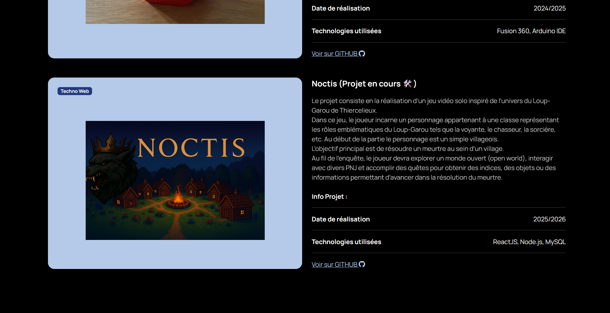
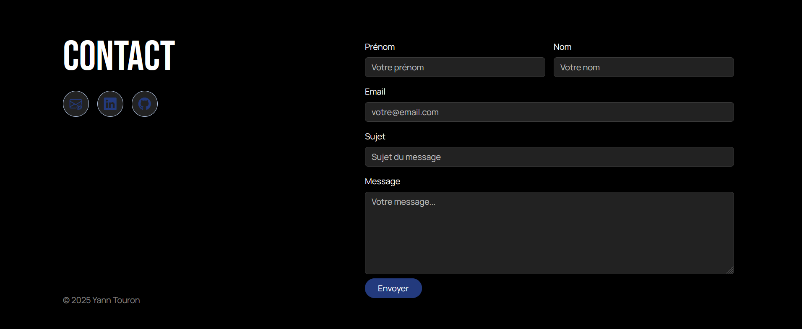
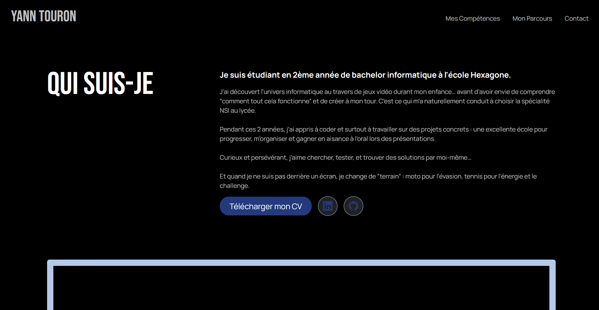
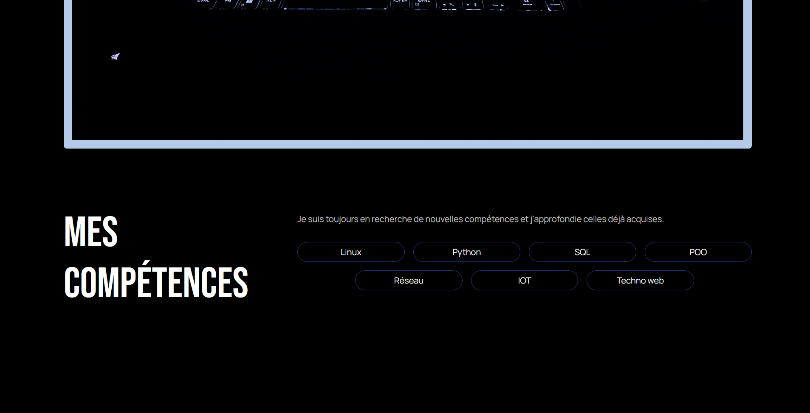
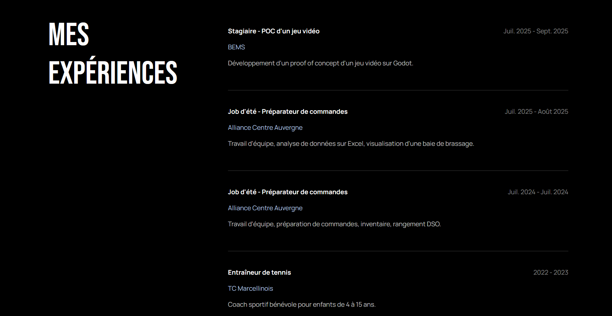
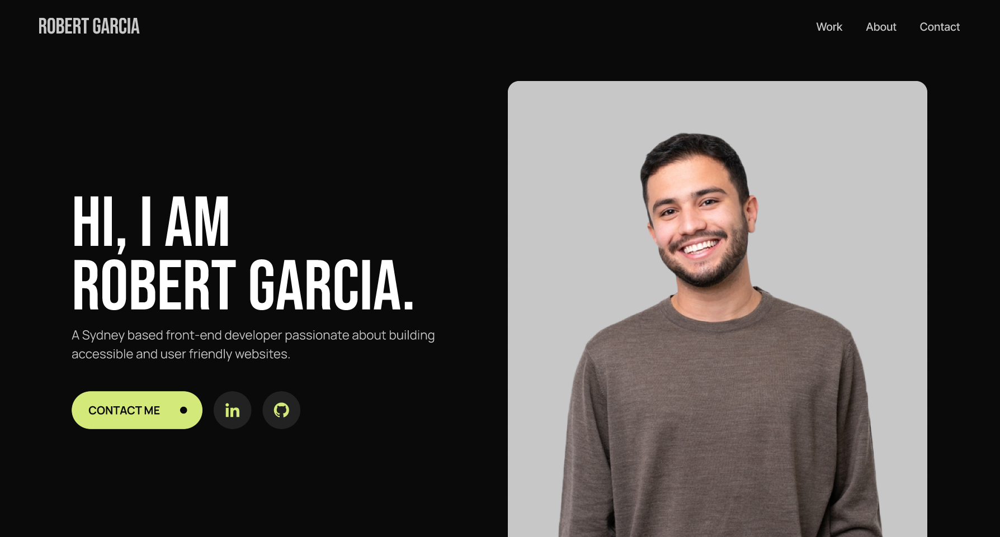
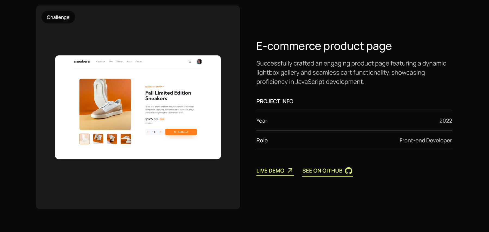
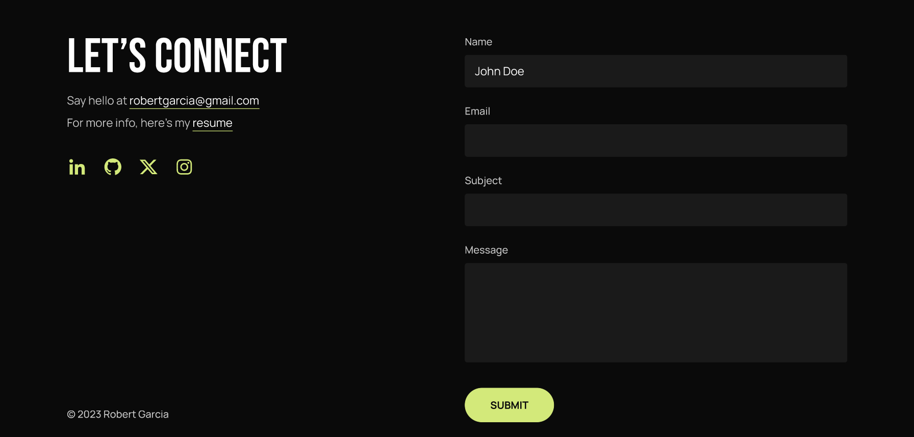

# Portfolio - Yann Touron

## Aperçu du portfolio

### Captures d’écran

#### Page index

#### Page about

---

## Maquette Figma
- Lien Figma : **https://www.figma.com/design/ri20KoAVFqoAv84yBf67nj/Portfolio-for-Developers--Community-?node-id=0-1&p=f&t=S2Ak85RCh332yJkF-0**  

### Captures de la maquette

---

## Technologies utilisées
- **HTML**
- **CSS**
- **Sass (SCSS)**
- **JavaScript**
- **Bootstrap**
- **Bootstrap Icons**
- **Google Fonts**

---

## Lancer le projet en local

### 1) Prérequis
- Avoir un navigateur.
- Optionnel : une extension de **serveur local** type *Live Server* (VS Code).

### 2) Installation
- git clone https://github.com/Couex04/Couex04.github.io.git

### 3) Ouvrir le site
- Copier le chemin d’accès (path) Windows dans votre navigateur du fichier **index.html**
- Si vous avez une extension de **serveur local** par exemple *Live Server* sur VS Code, ouvrez VS Code et lancez le serveur de la page **index.html**

--- 

## Coordonnées

- Email : yann.touron04@gmail.com
- LinkedIn : https://www.linkedin.com/in/yann-touron-b0b149353/

--- 

*Portfolio réalisé en 2025, en 2ème année à l'école Hexagone.*